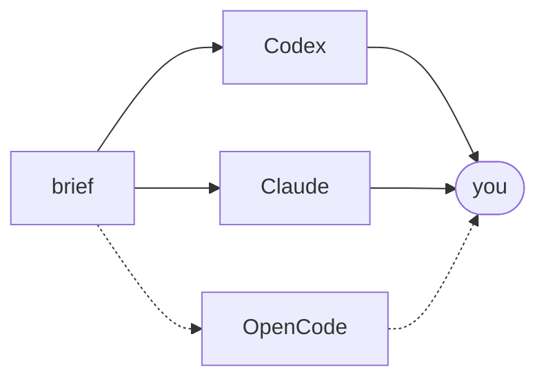
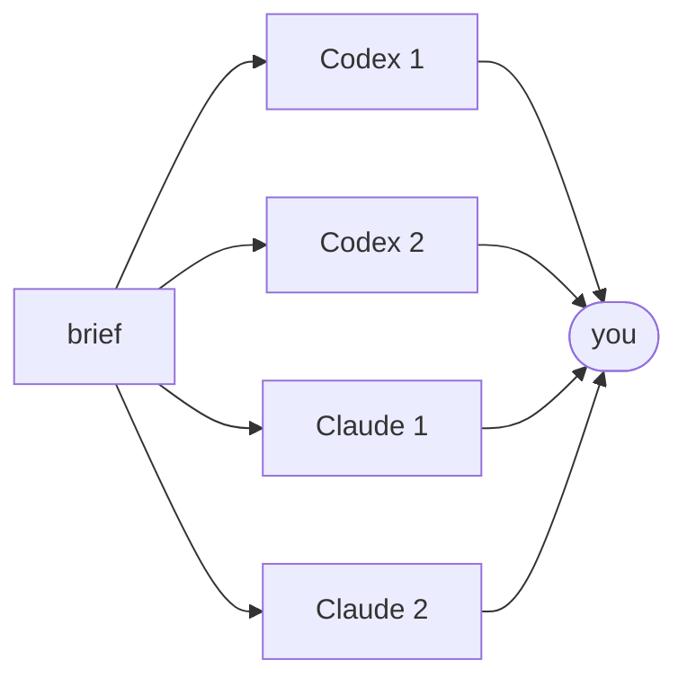
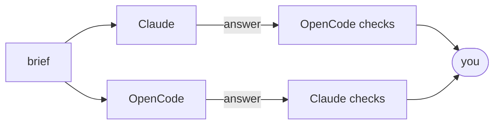
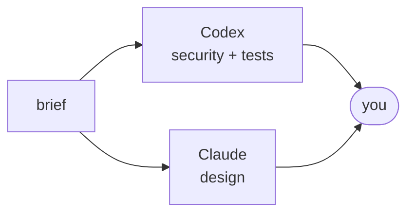

# polybrief

**Ask several AI coding agents the same question. Get independent answers, side by side.**

One agent can be confidently wrong, and you will not notice. polybrief gives the same
task (a *brief*) to Codex, Claude Code, and optionally OpenCode. Each agent reads your
project on its own and answers. If you want, they then check each other's answers.
You get every answer in one folder and decide what to trust.

- **Code review** of a branch: two reviewers on different models, not one.
- **Research**: compare approaches, then let each agent challenge the other.
- **Any other read-only question** about a project: write a brief in plain text.

The agents run **read-only**: they read your code, they do not change it.

## Install

macOS or Linux:

```bash
curl -fsSL https://raw.githubusercontent.com/ivklgn/polybrief/main/install.sh | sh
```

Windows (PowerShell):

```powershell
irm https://raw.githubusercontent.com/ivklgn/polybrief/main/install.ps1 | iex
```

Or with Go 1.25+: `go install github.com/ivklgn/polybrief@latest`.

You also need the agent CLIs you want to use, already logged in: `codex`, `claude`, and/or `opencode`.

## Try it

Review your branch against `main`:

```bash
polybrief -C ~/my-repo -b main examples/code-review/brief.md
```

Ask a research question, with a cross-check round:

```bash
polybrief -C ~/my-project -p crosscheck examples/research/brief.md
```

A brief is just a Markdown file with the task, for example:

```text
Review the supplied Git change for correctness, security, and missing tests.
Report only actionable problems supported by the code. Do not change any file.
```

A run takes a few minutes. The first line of output, `OUT <dir>`, is the folder with every
prompt, answer, and log. The last line, `RESULT`, says `complete`, `partial`, `stale`, or `failed`.

## Patterns: how the agents work together

A pattern is a small Markdown file that says who answers and in which order.

**`parallel`** (default): Codex and Claude answer independently. Add OpenCode, or pick
any agents, with `-w`: `-w codex,claude,opencode`.



**`twice`**: each agent answers twice, independently.



**`crosscheck`**: independent answers, then each agent checks the other's answer.
You get both answers and both checks. The default pair is Codex and Claude; this is
`-p crosscheck -w claude,opencode`.



**`panel`**: a review where each agent takes a different focus.



Choose one with `-p NAME`. In `parallel` and `crosscheck`, `-w` chooses the agents:
`-w opencode` runs OpenCode alone. `twice` and `panel` name Codex and Claude in their
`run:` lines; to use OpenCode there, copy the pattern and change those lines. OpenCode
needs `opencode.model` ([OpenCode example](examples/opencode/README.md)).

How each pattern works, what it gives, and which tasks it fits:
[pattern guide](docs/patterns.md). Run `polybrief plan -p NAME` to see the stages and the
maximum number of agent calls before you spend any limits. You can write your own pattern; see [`patterns/`](patterns/)
and the [refute example](examples/refute/README.md).

## Good to know

- Each agent call is a full agent session. It uses your subscription limits or API key.
- Read-only mode blocks writes. It does not hide files: an agent can still read any
  file your user account can read. Details and limits per agent: [details](docs/details.md#configure).
- polybrief does not judge the answers. You (or your main agent) check each finding against the code.
- Windows support is experimental. The OpenCode worker is experimental.

## Use it from your agent

polybrief is a plain shell command, so a host agent (Claude Code, Codex, and others)
can call it. For example, a code review skill can ask for a second opinion:

```bash
polybrief -b "$(git merge-base HEAD origin/main)" --label codereview examples/code-review/brief.md
```

The skill runs this in the background, reads each answer from `<OUT>/review/1/<worker>.md`,
and checks every `FINDING` against the code before it reports it. A ready skill to copy:
[examples/code-review/SKILL.md](examples/code-review/SKILL.md). If your skill already has
reviewer instructions, pass them to `-p panel` with `-c FILE`
([how](examples/code-review/README.md#from-a-code-review-skill)).

## More

[Full reference: flags, settings, safety limits, tests](docs/details.md) ·
[Pattern guide](docs/patterns.md) ·
[Examples](examples/README.md) ·
[Settings template](polybrief.conf.example) ·
[Design decisions](.archcore/architecture/)
