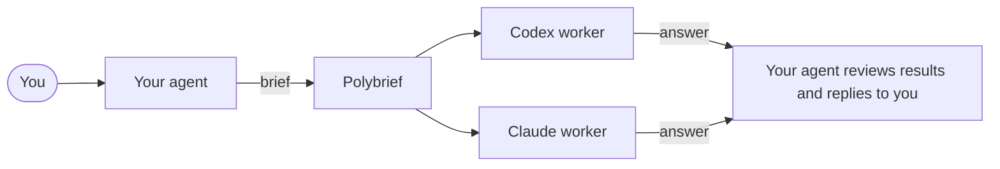
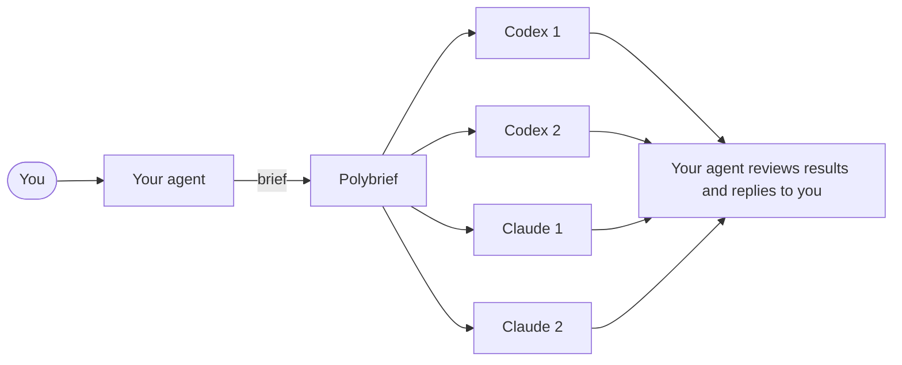
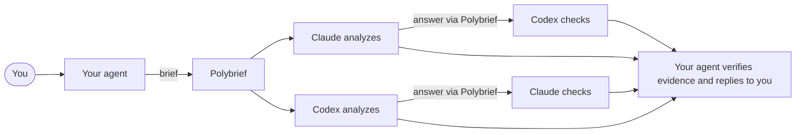
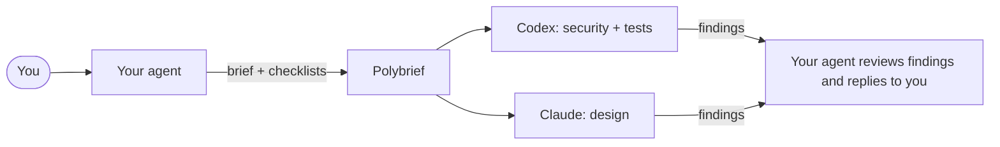

# polybrief

**Ask several AI coding agents the same question. Get independent answers, side by side.**

The main workflow starts in the agent you already use. It sends a task (a
*brief*) to polybrief, which starts separate Codex, Claude Code, or OpenCode
workers. Each reads your project and answers independently. Your main agent
checks their answers and reports back to you. You can also run polybrief
directly from a terminal.

- **Code review** of a branch: two reviewers on different models, not one.
- **Research**: compare approaches, then let each agent challenge the other.
- **Any other read-only question** about a project: write a brief in plain text.

The agents run **read-only**: they read your code, they do not change it.

## Install

macOS or Linux:

```bash
curl -fsSL https://raw.githubusercontent.com/ivklgn/polybrief/main/install.sh | sh
```

Windows (PowerShell):

```powershell
irm https://raw.githubusercontent.com/ivklgn/polybrief/main/install.ps1 | iex
```

The install puts one binary on your `PATH`. It creates no settings directory.
Or use Go 1.25+: `go install github.com/ivklgn/polybrief@latest`.
Worker isolation on Windows is experimental.

You also need the agent CLIs you want to use, already logged in: `codex`, `claude`, and/or `opencode`.

## Try it

Review your branch against `main` with a short brief:

```bash
printf 'Review this change for bugs and missing tests. Report only findings backed by code.\n' | polybrief -C ~/my-repo -b main -
```

Ask any read-only question, with a cross-check round:

```bash
echo "Compare the two caching layers in this project. Cite files." | polybrief -C ~/my-project -p crosscheck -
```

A brief is the task in plain text. Pass a file path, or `-` to read it from stdin.

A run takes a few minutes. The first line of output, `OUT <dir>`, is the folder with every
prompt and answer. One `WORKER` line per answer gives its status and path. `RESULT` says
`complete`, `partial`, `stale`, or `failed`; then every answer is printed in full between
`<answer-…>` tags, so your agent reads them without opening files. A worker that failed or
is not installed is named on stderr with the path of its log.

## Two ready-to-copy examples

| Example | Pattern | Workers | What it shows |
| --- | --- | --- | --- |
| [Code review skill](examples/code-review/README.md) | `parallel` | Codex + OpenCode | Two independent reviews of one Git change; the skill verifies findings before reporting them. |
| [Research skill](examples/research/README.md) | `crosscheck` | Claude + Codex | Two independent analyses, then each agent critiques the other's evidence. |

The code review folder also shows `twice` and `panel` commands for the same brief.

Each folder contains a `SKILL.md` and a `references/` directory with a sample brief.
The skill calls Polybrief directly. Copy the folder
to your agent's skills directory or run the command in its README yourself.
OpenCode requires an explicit model.

## Patterns: how the agents work together

A pattern is a small Markdown file that says who answers and in which order.
You are already working in a main agent, such as Codex or Claude Code. It sends
the brief to Polybrief, checks the worker answers, and replies to you. Each
worker is a separate read-only agent session, even if it uses the same CLI as
the main agent.

**`parallel`** (default): Codex and Claude answer independently. Add OpenCode, or pick
any agents, with `-w`: `-w codex,claude,opencode`.



**`twice`**: each agent answers twice, independently.



**`crosscheck`**: independent answers, then each agent checks the other's answer.
You get both answers and both checks. The default pair is Codex and Claude;
the [research example](examples/research/README.md) chooses them explicitly.



**`panel`**: a review where each agent takes a different focus.



Choose one with `-p NAME`. The four named patterns are built into the binary. In
`parallel` and `crosscheck`, `-w` chooses the agents:
`-w opencode` runs OpenCode alone. `twice` and `panel` name Codex and Claude in their
`run:` lines; to use OpenCode there, copy the pattern file and change those lines.
OpenCode needs `-o opencode.model=provider/model`. The `panel` pattern needs
`review-security.md` and `review-tests.md`, supplied with `-c FILE`.

## Contributing and license

See [CONTRIBUTING.md](CONTRIBUTING.md). polybrief is released under the [MIT License](LICENSE).

## Quick reference

`polybrief [-C DIR] [-b GIT_BASE] [-p PATTERN] [-w AGENTS] [-c FILE]... [-o KEY=VALUE]... BRIEF|-`

Use `polybrief patterns` to list the built-in patterns, `polybrief plan -p NAME` to
see stages and the call count without starting a worker, `polybrief config` to see
every setting with its source, and `-p ./my-pattern.md` for your own pattern (keep
it outside the reviewed project). Each worker call uses your CLI subscription or
API key. Read-only permissions do not hide files the user account can read; check
findings before acting on them.

[Command reference](.archcore/runtime/polybrief-reference.doc.md) ·
[Pattern guide](.archcore/runtime/polybrief-patterns.doc.md) ·
[Examples](examples/README.md)
